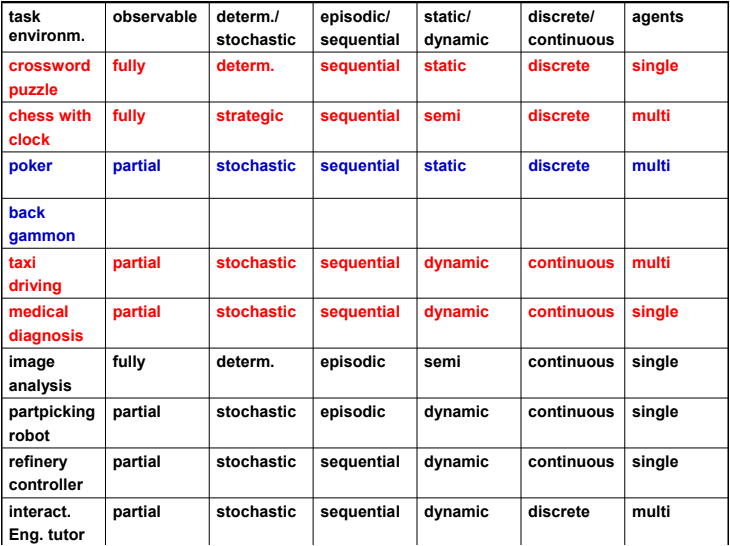

# Environment

* PEAS
  * Performance measure
  * Environment
  * Actuators
  * Sensors

### Types

* Fully vs Partially Observable
* Deterministic vs Stochastic
* Episodic vs Sequential
* Static vs Dynamic
* Discrete vs Continuous
* Single agent vs multi-agent

