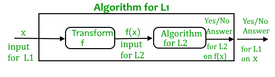

# Time complexity classes

O(1)
loop with constant 
swap

1. O(n): if the loop variables is incremented / decremented by a constant amount.
3. O(nc): Time complexity of nested loops is equal to the number of times the innermost statement is executed.
4. O(Logn) Time Complexity of a loop is considered as O(Logn) if the loop variables is divided / multiplied by a constant amount.
5. Binary -> is 1, c, c2, c3, … ck. If we put k equals to Logcn, we get cLogcn which is n.
5. O(LogLogn) Time Complexity of a loop is considered as O(LogLogn) if the loop variables is reduced / increased exponentially by a constant amount.

```
// Here c is a constant greater than 1   
for (int i = 2; i <=n; i = pow(i, c)) { 
    // some O(1) expressions
}
//Here fun is sqrt or cuberoot or any other constant root
for (int i = n; i > 1; i = fun(i)) { 
    // some O(1) expressions
}
```

See this for mathematical details.

https://www.geeksforgeeks.org/time-complexity-loop-loop-variable-expands-shrinks-exponentially/

### How to combine time complexities of consecutive loops?

When there are consecutive loops, we calculate time complexity as sum of time complexities of individual loops.

How to calculate time complexity when there are many if, else statements inside loops?

Consider worst case bitch! What did you expect you little piece of shit

For example consider the linear search function where we consider the case when element is present at the end or not present at all.
When the code is too complex to consider all if-else cases, we can get an upper bound by ignoring if else and other complex control statements.


# P <Problems>
solved by deterministic Turing machine in Polynomial time.

# NP <Non-P>
* set of decision *problems*
* solved by a Non-deterministic Turing Machine in Polynomial time. 
* P is subset of NP.

__NP is set of decision problems which can be solved by a polynomial time via a “Lucky Algorithm”, a magical algorithm that always makes a right guess among the given set of choices__

 L: A decision problem.
 A: Algoriithm on L.

NP-complete are hardest in NP set. L is NP-complete if:
1) L is in NP (Any given solution for NP-complete problems can be verified quickly, but there is no efficient known solution).
2) Every problem in NP is reducible to L in polynomial time.

NP-Hard -> follows property 2 but no neccassirally property 1.
NP-Complete set is also a subset of NP-Hard set.

# Decision vs Optimization Problems

* NP-completeness applies on *decision problems*.
* As it’s easier to compare the difficulty of decision problems than that of *optimization* problems.
* In reality, though, being able to solve a decision problem in polynomial time will often permit us to solve the corresponding optimization problem *in polynomial time* (using a polynomial number of calls to the decision problem). 
* So, discussing the difficulty of decision problems is often really equivalent to discussing the difficulty of optimization problems.

For example, consider the vertex cover problem (Given a graph, find out the minimum sized vertex set that covers all edges). It is an optimization problem. Corresponding decision problem is, given undirected graph G and k, is there a vertex cover of size k?
 
# Reduction



* if A1 solves L1. i.e.  x1->A1->y1 given l1 = {x1,y1}
* if A2 solves L2. i.e.  x2->A2->y2 given l2 = {x2,y2}
* Transoform input x1 into x2 with funtion f
* such that A1 = A2(f(x1))
* The idea is to find a transformation(f) from L1 to L2 so that the algorithm A2 can be part of an algorithm A1 to solve L1.


* Learning reduction in general is very important. 
* if we have library functions to solve certain problem and if we can reduce a new problem to one of the solved problems, we save a lot of time.
* For example,  Consider the example of a problem where we have to find minimum product path in a given directed graph where product of path is multiplication of weights of edges along the path. If we have code for Dijkstra’s algorithm to find shortest path, we can take log of all weights and use Dijkstra’s algorithm to find the minimum product path rather than writing a fresh code for this new problem.

# How to prove that a given problem is NP complete?

* From the definition of NP-complete, it appears impossible to prove that a problem L is NP-Complete. 
* By definition, it requires us to that show every problem in NP is polynomial time reducible to L.
* Fortunately, there is an alternate way to prove it.   
* The idea is to take a known NP-Complete problem and reduce it to L.  
* If polynomial time reduction is possible, we can prove that L is NP-Complete by *transitivity* of reduction (If a NP-Complete problem is reducible to L in polynomial time, then all problems are reducible to L in polynomial time).

# first problem as NP-Complete

[(SAT)Boolean satisfiability problem](https://en.wikipedia.org/wiki/Boolean_satisfiability_problem)

* It is always useful to know about NP-Completeness even for engineers. 
* Suppose you are asked to write an efficient algorithm to solve an extremely important problem for your company.
* After a lot of thinking, you can only come up exponential time approach which is impractical. 
* If you don’t know about NP-Completeness, you can only say that I could not come with an efficient algorithm.
* If you know about NP-Completeness and prove that the problem as NP-complete, you can proudly say that the polynomial time solution is unlikely to exist.
* If there is a polynomial time solution possible, then that solution solves a big problem of computer science many scientists have been trying for years.
