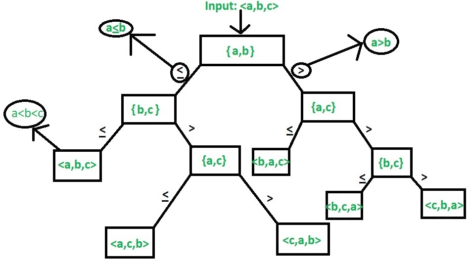
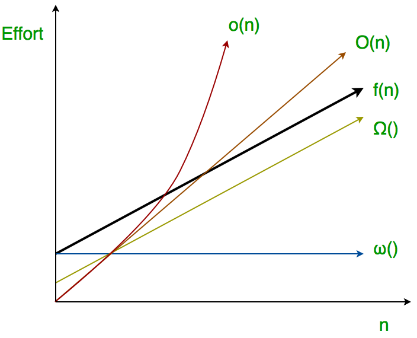

# Algorithm Analysis



### Why

* Care about user friendliness, modularity, security, maintainability, etc?
* turns out you cant do that without performance.
* So performance is like currency through which we can buy all the above things
* performance == scale.

### Why not just run it? (see running time)

1. Different machines -> Different comparison.
2. Different input -> Different comparison.

**Big Idea** -> Asymptotic analysis (just depends on input)

Linear Search running time in seconds on A: 0.2 * n
Binary Search running time in seconds on B: 1000*log(n)

We ignore constants in Asymptotic Analysis.

* Also, in Asymptotic analysis, we always talk about input sizes larger than a constant value.
* So, you may end up choosing an algorithm that is Asymptotically slower but faster for your software.

### Worst Case

Upper bound of running -> should know when.

Θ(n)

### Average Case (Rarely)

For the linear search problem, let us assume that all cases are uniformly distributed (including the case of x not being present in array). So we sum all the cases and divide the sum by (n+1). Following is the value of average case time complexity.

### Best Case Analysis (Bogus)

Θ(1)

### Why not average?

The average case analysis is not easy to do in most of the practical cases and it is rarely done. In the average case analysis, we must know (or predict) the mathematical distribution of all possible inputs.

For some algorithms, all the cases are asymptotically same, i.e., there are no worst and best cases.
eg Merge sort - > Θ(nLogn) 

Most of the other sorting algorithms have worst and best cases.

For example, in the typical implementation of Quick Sort (where pivot is chosen as a corner element), the worst occurs when the input array is already sorted and the best occur when the pivot elements always divide array in two halves. For insertion sort, the worst case occurs when the array is reverse sorted and the best case occurs when the array is sorted in the same order as output. 

The main idea of asymptotic analysis is to 
* have a measure of efficiency of algorithms that doesn’t depend on machine specific constants, 
* and doesn’t require algorithms to be implemented and time taken by programs to be compared. 

### Notations

```
Θ(g(n)) = {f(n): there exist positive constants c1, c2 and n0 such 
                 that 0 <= c1*g(n) <= f(n) <= c2*g(n) for all n >= n0}
```

The theta notation bounds a functions from above and below, so it defines exact asymptotic behavior.
A simple way to get Theta notation of an expression is to drop low order terms and ignore leading constants

*f(n) must be non-negative for values of n greater than n0.*


##### Why drop?

its fine chill.

```
O(g(n)) = { f(n): there exist positive constants c and 
                  n0 such that 0 <= f(n) <= c*g(n) for 
                  all n >= n0}
```


Big O notation defines an upper bound of an algorithm, it bounds a function only from above

O(n^2) also covers linear time. -> quick sort

```
Ω (g(n)) = {f(n): there exist positive constants c and
                  n0 such that 0 <= c*g(n) <= f(n) for
                  all n >= n0}.
```

Ω notation provides an asymptotic lower bound.

### Properties

##### General Properties

If f(n) is O(g(n)) then a*f(n) is also O(g(n)) ; where a is a constant.
If f(n) is Θ(g(n)) then a*f(n) is also Θ(g(n)) ; where a is a constant.
If f(n) is Ω (g(n)) then a*f(n) is also Ω (g(n)) ; where a is a constant.

##### Reflexive Properties

If f(n) is given then f(n) is O(f(n)).
If f(n) is given then f(n) is Θ(f(n)).
If f(n) is given then f(n) is Ω (f(n)).

##### Transitive Properties
  
If f(n) is O(g(n)) and g(n) is O(h(n)) then f(n) = O(h(n)) .
If f(n) is Θ(g(n)) and g(n) is Θ(h(n)) then f(n) = Θ(h(n)) .
If f(n) is Ω (g(n)) and g(n) is Ω (h(n)) then f(n) = Ω (h(n))

##### Symmetric Properties

If f(n) is Θ(g(n)) then g(n) is Θ(f(n)) . *This property only satisfies for Θ notation.*

##### Transpose Symmetric Properties

If f(n) is O(g(n)) then g(n) is Ω (f(n)). *This property only satisfies for O and Ω notations.*

##### Some More Properties

If f(n) = O(g(n)) and f(n) = Ω(g(n)) then f(n) = Θ(g(n))
If f(n) = O(g(n)) and d(n)=O(e(n))
then f(n) + d(n) = O( max( g(n), e(n) ))
Example: f(n) = n i.e O(n)
d(n) = n² i.e O(n²)
then f(n) + d(n) = n + n² i.e O(n²)
If f(n)=O(g(n)) and d(n)=O(e(n))
then f(n) * d(n) = O( g(n) * e(n) )
Example: f(n) = n i.e O(n)
d(n) = n² i.e O(n²)
then f(n) * d(n) = n * n² = n³ i.e O(n³)

Time complexity of all computer algorithms can be written as Ω(1)

**Little o** provides strict upper bound (equality condition is removed from Big O) and little omega provides strict lower bound (equality condition removed from big omega)

### Little ο asymptotic notation

Let f(n) and g(n) be functions that map positive integers to positive real numbers. We say that f(n) is ο(g(n)) (or f(n) Ε ο(g(n))) if for any real constant c > 0, there exists an integer constant n0 ≥ 1 such that 0 ≤ f(n) < c*g(n).

Thus, little o() means loose upper-bound of f(n). Little o is a rough estimate of the maximum order of growth whereas Big-Ο may be the actual order of growth.

```
In mathematical relation,
f(n) = o(g(n)) means
lim  f(n)/g(n) = 0
n→∞

lim  f(n)/g(n) = lim  (7n + 8)/(n2) = lim  7/2n = 0 (l’hospital)
n→∞ n→∞ n→∞
hence 7n + 8 ∈ o(n2)
```

### Little ω asymptotic notation



Let f(n) and g(n) be functions that map positive integers to positive real numbers. We say that f(n) is ω(g(n)) (or f(n) ∈ ω(g(n))) if for any real constant c > 0, there exists an integer constant n0 ≥ 1 such that f(n) > c * g(n) ≥ 0 for every integer n ≥ n0.

Little Omega (ω) is a rough estimate of the order of the growth whereas Big Omega (Ω) may represent exact order of growth. We use ω notation to denote a lower bound that is not asymptotically tight.
And, f(n) ∈ ω(g(n)) if and only if g(n) ∈ ο((f(n)).

```
if f(n) ∈ ω(g(n)) then,

lim  f(n)/g(n) = ∞
n→∞

Prove that 4n + 6 ∈ ω(1);
````