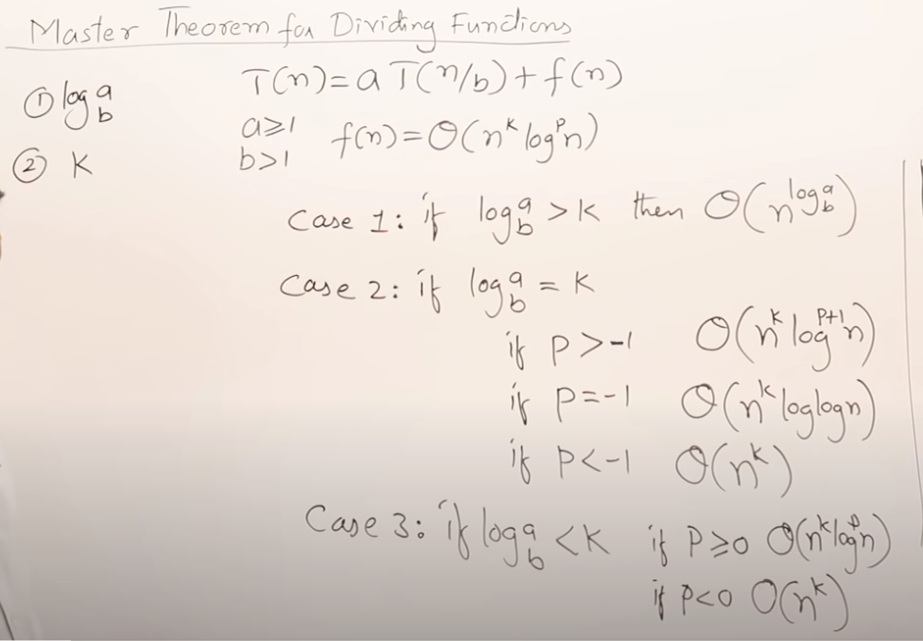

# Master's Theorum

Master Method is a direct way to get the solution. The master method works only for following type of recurrences or for recurrences that can be transformed to following type.

T(n) = aT(n/b) + f(n) where a >= 1 and b > 1

There are following three cases:

1. If f(n) = Θ(nc) where c < Logba then T(n) = Θ(nLogba)
2. If f(n) = Θ(nc) where c = Logba then T(n) = Θ(ncLog n)
3. If f(n) = Θ(nc) where c > Logba then T(n) = Θ(f(n))

### How does this work?

Master method is mainly derived from recurrence tree method. If we draw recurrence tree of T(n) = aT(n/b) + f(n), we can see that the work done at root is f(n) and work done at all leaves is Θ(nc) where c is Logba. And the height of recurrence tree is Logbn
Master Theorem
In recurrence tree method, we calculate total work done. If the work done at leaves is polynomially more, then leaves are the dominant part, and our result becomes the work done at leaves (Case 1). If work done at leaves and root is asymptotically same, then our result becomes height multiplied by work done at any level (Case 2). If work done at root is asymptotically more, then our result becomes work done at root (Case 3).

Examples of some standard algorithms whose time complexity can be evaluated using Master Method
Merge Sort: T(n) = 2T(n/2) + Θ(n). It falls in case 2 as c is 1 and Logba] is also 1. So the solution is Θ(n Logn)

Binary Search: T(n) = T(n/2) + Θ(1). It also falls in case 2 as c is 0 and Logba is also 0. So the solution is Θ(Logn)

Notes:
1. It is not necessary that a recurrence of the form T(n) = aT(n/b) + f(n) can be solved using Master Theorem. The given three cases have some gaps between them. For example, the recurrence T(n) = 2T(n/2) + n/Logn cannot be solved using master method.
2. Case 2 can be extended for f(n) = Θ(ncLogkn). If f(n) = Θ(ncLogkn) for some constant k >= 0 and c = Logba, then T(n) = Θ(ncLogk+1n)

http://www.csd.uwo.ca/~moreno//CS424/Ressources/master.pdf

TODO