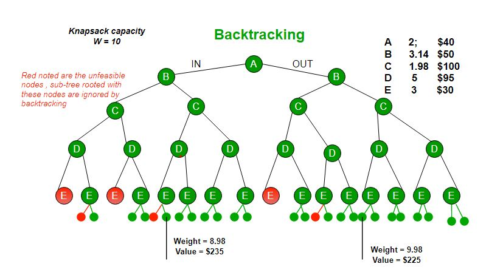

# Knapsack

### Bound

The idea is to use the fact that the Greedy approach provides the best solution for Fractional Knapsack problem.
To check if a particular node can give us a better solution or not, we compute the optimal solution (through the node) using Greedy approach. If the solution computed by Greedy approach itself is more than the best so far, then we can’t get a better solution through the node

Sort all items in decreasing order of ratio of value per unit weight so that an upper bound can be computed using Greedy Approach.
Initialize maximum profit, maxProfit = 0
Create an empty queue, Q.
Create a dummy node of decision tree and enqueue it to Q. Profit and weight of dummy node are 0.
Do following while Q is not empty.
Extract an item from Q. Let the extracted item be u.
Compute profit of next level node. If the profit is more than maxProfit, then update maxProfit.
Compute bound of next level node. If bound is more than maxProfit, then add next level node to Q.
Consider the case when next level node is not considered as part of solution and add a node to queue with level as next, but weight and profit without considering next level nodes.




O(2^n), O(1)

```
struct Item 
{ 
	float weight; 
	int value; 
}; 


struct Node 
{ 
	int level, profit, bound; 
	float weight; 
}; 

bool cmp(Item a, Item b) 
{ 
	double r1 = (double)a.value / a.weight; 
	double r2 = (double)b.value / b.weight; 
	return r1 > r2; 
} 

int bound(Node u, int n, int W, Item arr[]) 
{ 
	if (u.weight >= W) 
		return 0; 

	int profit_bound = u.profit; 

	int j = u.level + 1; 
	int totweight = u.weight; 

	while ((j < n) && (totweight + arr[j].weight <= W)) 
	{ 
		totweight += arr[j].weight; 
		profit_bound += arr[j].value; 
		j++; 
	} 

	if (j < n) 
		profit_bound += (W - totweight) * arr[j].value / 
										arr[j].weight; 

	return profit_bound; 
} 

int knapsack(int W, Item arr[], int n) 
{ 

	sort(arr, arr + n, cmp); 

	queue<Node> Q; 
	Node u, v; 

	u.level = -1; 
	u.profit = u.weight = 0; 
	Q.push(u); 

	int maxProfit = 0; 
	while (!Q.empty()) 
	{ 
		u = Q.front(); 
		Q.pop(); 

		if (u.level == -1) 
			v.level = 0; 

		if (u.level == n-1) 
			continue; 
 
		v.level = u.level + 1; 

		v.weight = u.weight + arr[v.level].weight; 
		v.profit = u.profit + arr[v.level].value; 

		if (v.weight <= W && v.profit > maxProfit) 
			maxProfit = v.profit; 
 
		v.bound = bound(v, n, W, arr); 

		if (v.bound > maxProfit) 
			Q.push(v); 

		v.weight = u.weight; 
		v.profit = u.profit; 
		v.bound = bound(v, n, W, arr); 
		if (v.bound > maxProfit) 
			Q.push(v); 
	} 

	return maxProfit; 
} 
```