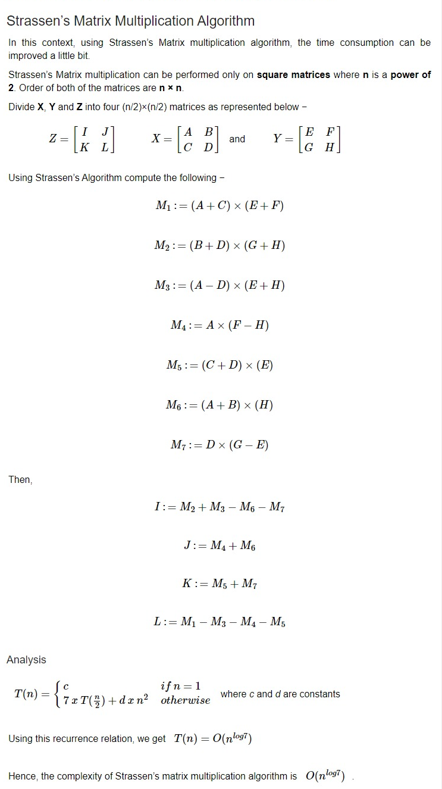

# Strassen’s Matrix Multiplication



O(N^2.8074) <T(N) = 7T(N/2) +  O(N2)>, submatrices in recursion </br>
BRUTEFORCE: O(N3) <T(N) = 8T(N/2) + O(N2)>  </br>
Strassen’s method -> reduce recursive calls to 7. </br>

Strassen’s Method is not preferred </br>

1. constants are high.
2. Sparse matrices have special methods
3. submatrices take extra space.
4. larger errors accumulate due to computer inprecision <float>

```
#define V 4

void split(int x[V][V], int y[V][V]){

}

int[V][V] multiply(int x[V][V], int y[V][V]){

}

int main(){
    int a[V][V] = {{1,2,34,34,}, {1,2,34,34,}, {1,2,34,34,}, {1,2,34,34,}};
    int b[V][V] = {{1,2,34,34,}, {1,2,34,34,}, {1,2,34,34,}, {1,2,34,34,}};

    return 0;
}
```