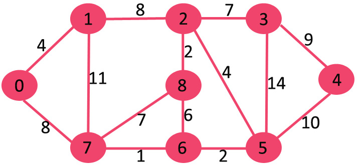

# Dijkstra

O(V^2) , <Space Complexity>
PRE: trees, prim's mst
NOTE: 
Similar to prim's mst
we generate a SPT (shortest path tree) with source as root
two sets -> contains vertices included in shortest path tree, if not then other set.
find vertex in other set with min distance from source.

1. If path is needed then maintain parent array.
2. mainly for undirected graph, can be customized for directed.
3. code gets min distance of source to every vertex, if want only one, break loop at finding it.
4.  input graph -> adjacency list, reduced to O(E log V) with binary heap. 
5. only for +ve weghts, -ve -> Bellman–Ford.



```
#define V 9

int minDistance(int dist[], bool sptSet[]){

    int min = INT_MAX, min_index;
    for (int v = 0; v<V; v++)
        if(!sptSet[v] && dist[v]<min){
             min = dist[v];
             min_index = v;
        }

    return min_index;
}

void printSolution(int dist[]){

    cout << "distance from src:" << endl; 

    for(int i = 0; i<V; i++){
        cout << i + ": "  << dist[i] << endl;
    }
}

void dijkstra(int graph[V][V], int src){

    int dist[V]; distance from (Src)
    bool sptSet[V]; if v is in shortest path set

    for(int v = 0; v < V; v++)
        dist[v] = INT_MAX, sptSet[v] = false;
    
    dist[src] = 0;

    for (int count = 0; count<V-1; count++){
        int u = minDistance(dist, sptSet);
        sptSet[u] = true;

         for (int v = 0; v < V; v++) 
         if (!sptSet[v] && graph[u][v] && dist[u] != INT_MAX 
                && dist[u] + graph[u][v] < dist[v]) 
                dist[v] = dist[u] + graph[u][v]; 


    } 

    printSolution(dist); 
}

int main() 
{ 
    see dikjitsra_graph.bmp
    int graph[V][V] = { { 0, 4, 0, 0, 0, 0, 0, 8, 0 }, 
                        { 4, 0, 8, 0, 0, 0, 0, 11, 0 }, 
                        { 0, 8, 0, 7, 0, 4, 0, 0, 2 }, 
                        { 0, 0, 7, 0, 9, 14, 0, 0, 0 }, 
                        { 0, 0, 0, 9, 0, 10, 0, 0, 0 }, 
                        { 0, 0, 4, 14, 10, 0, 2, 0, 0 }, 
                        { 0, 0, 0, 0, 0, 2, 0, 1, 6 }, 
                        { 8, 11, 0, 0, 0, 0, 1, 0, 7 }, 
                        { 0, 0, 2, 0, 0, 0, 6, 7, 0 } }; 
  
    dijkstra(graph, 0); 
  
    return 0; 
} 
```