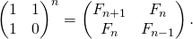

# Maths

### Multiple of 3

Proof:
Above can be proved by taking the example of 11 in decimal numbers. (In this context 11 in decimal numbers is same as 3 in binary numbers)
If difference between sum of odd digits and even digits is multiple of 11 then decimal number is multiple of 11. Let’s see how.

Let’s take the example of 2 digit numbers in decimal
AB = 11A -A + B = 11A + (B – A)
So if (B – A) is a multiple of 11 then is AB.

Let us take 3 digit numbers.

ABC = 99A + A + 11B – B + C = (99A + 11B) + (A + C – B)
So if (A + C – B) is a multiple of 11 then is (ABC)

Let us take 4 digit numbers now.
ABCD = 1001A + D + 11C – C + 999B + B – A
= (1001A – 999B + 11C) + (D + B – A -C )
So, if (B + D – A – C) is a multiple of 11 then is ABCD.

This can be continued for all decimal numbers.
Above concept can be proved for 3 in binary numbers in the same way.

```
int isMultipleOf3(int n) 
{ 
    int odd_count = 0; 
    int even_count = 0; 
  
    if (n < 0) 
        n = -n; 
    if (n == 0) 
        return 1; 
    if (n == 1) 
        return 0; 
  
    while (n) { 
        if (n & 1) 
            odd_count++; 
  
        if (n & 2) 
            even_count++; 
        n = n >> 2; 
    } 
  
    return isMultipleOf3(abs(odd_count - even_count)); 
} 
```

### Multiply by 7

7n = 8n -n

```
n<<3 -n 
```

Note: Works only for positive integers.
Same concept can be used for fast multiplication by 9 or other numbers.

### Lucky number

```
bool isLucky(int n) 
{ 
    static int counter = 2; 
     
    int next_position = n; 
    if(counter > n) 
        return 1; 
    if(n % counter == 0) 
        return 0; 

    counter++; 
    return isLucky(next_position); 
} 
```

### Base n Addition

column by column addition -> carry if sum > base -> sum - base;

```
char *sumBase14(char num1[], char num2[]) 
{ 
	int l1 = strlen(num1); 
	int l2 = strlen(num2); 
	char *res; 
	int i; 
	int nml1, nml2, res_nml; 
	bool carry = 0; 
		
	if(l1 != l2) 
	{ 
		cout << "Function doesn't support numbers of different"
				" lengths. If you want to add such numbers then"
				" prefix smaller number with required no. of zeroes"; 
		assert(0); 
	} 
	
	res = new char[(sizeof(char)*(l1 + 1))]; 
			
	for(i = l1-1; i >= 0; i--) 
	{ 
		nml1 = getNumeralValue(num1[i]); 
		nml2 = getNumeralValue(num2[i]); 
		
		res_nml = carry + nml1 + nml2; 
		
		if(res_nml >= 14) 
		{ 
			carry = 1; 
			res_nml -= 14; 
		} 
		else
		{ 
			carry = 0; 
		} 
		res[i+1] = getNumeral(res_nml); 
	} 
		
	if(carry == 0) 
		return (res + 1); 
	
	res[0] = '1'; 
	return res; 
} 

int getNumeralValue(char num) 
{ 
	if( num >= '0' && num <= '9') 
		return (num - '0'); 
	if( num >= 'A' && num <= 'D') 
		return (num - 'A' + 10); 
			
	assert(0); 
} 

char getNumeral(int val) 
{ 
	if( val >= 0 && val <= 9) 
		return (val + '0'); 
	if( val >= 10 && val <= 14) 
		return (val + 'A' - 10); 
		
	assert(0); 
} 

```


Notes: 
The above approach can be used to add numbers to any base. We don’t have to do string operations if the base is smaller than 10.
You can try extending the above program for numbers of different lengths. 


### Square Root

```
 float squareRoot(float n) 
    { 
        /*We are using n itself as initial approximation 
          This can definitely be improved */
        float x = n; 
        float y = 1; 
        float e = 0.000001; /* e decides the accuracy level*/
        while (x - y > e) { 
            x = (x + y) / 2; 
            y = n / x; 
        } 
        return x; 
    } 
```

### Multiply two integers without using multiplication, division and bitwise operators, and no loops

```
public : int multiply(int x, int y) 
{ 
    if(y == 0) 
    return 0; 
  
    if(y > 0 ) 
    return (x + multiply(x, y-1)); 
  
    if(y < 0 ) 
    return -multiply(x, -y); 
}
```

### Russian Peasant (Multiply two numbers using bitwise operators)

```
unsigned int russianPeasant(unsigned int a, unsigned int b) 
{ 
    int res = 0;  // initialize result 
  
    // While second number doesn't become 1 
    while (b > 0) 
    { 
         // If second number becomes odd, add the first number to result 
         if (b & 1) 
             res = res + a; 
  
         // Double the first number and halve the second number 
         a = a << 1; 
         b = b >> 1; 
     } 
     return res; 
} 
```

How does this work?
The value of a*b is same as (a*2)*(b/2) if b is even, otherwise the value is same as ((a*2)*(b/2) + a). In the while loop, we keep multiplying ‘a’ with 2 and keep dividing ‘b’ by 2. If ‘b’ becomes odd in loop, we add ‘a’ to ‘res’. When value of ‘b’ becomes 1, the value of ‘res’ + ‘a’, gives us the result.
Note that when ‘b’ is a power of 2, the ‘res’ would remain 0 and ‘a’ would have the multiplication


### Print all combinations of points that can compose a given number

```
void printCompositions(int n, int i)  
{  
  
    static int arr[ARR_SIZE];  
      
    if (n == 0)  
    {  
        printArray(arr, i);  
    }  
    else if(n > 0)  
    {  
        int k;  
        for (k = 1; k <= MAX_POINT; k++)  
        {  
            arr[i]= k;  
            printCompositions(n-k, i+1);  
        }  
    }  
} 
```

### Write you own Power without using multiplication(*) and division(/) operators

###### Method 1 (Using Nested Loops)

```
int pow(int a, int b)  
{  
    if (b == 0)  
        return 1;  
    int answer = a;  
    int increment = a;  
    int i, j;  
    for(i = 1; i < b; i++)  
    {  
        for(j = 1; j < a; j++)  
        {  
            answer += increment;  
        }  
        increment = answer;  
    }  
    return answer;  
}  
```

###### Method 2 (Using Recursion)

```
/* A recursive function to get x*y */
int multiply(int x, int y) 
{ 
    if(y) 
        return (x + multiply(x, y - 1)); 
    else
        return 0; 
} 
  
/* A recursive function to get a^b 
Works only if a >= 0 and b >= 0 */
int pow(int a, int b) 
{ 
    if(b) 
        return multiply(a, pow(a, b - 1)); 
    else
        return 1; 
}  
```

### Fibonici

##### Method 1 (Recurssion)

Time Complexity: T(n) = T(n-1) + T(n-2) which is exponential. 
Extra Space: O(n) if we consider the function call stack size, otherwise O(1).

```
int fib(int n) 
{ 
    if (n <= 1) 
        return n; 
    return fib(n-1) + fib(n-2); 
} 
```

##### Method 2 (DP)

Time Complexity: O(n) 
Extra Space: O(n) 
 

```
int fib(int n) 
{ 

    int f[n + 2];  
    int i; 
  
    f[0] = 0; 
    f[1] = 1; 
  
    for(i = 2; i <= n; i++) 
    { 
    
       f[i] = f[i - 1] + f[i - 2]; 
    } 
    return f[n]; 
    } 
}; 
```

##### Method 3 (space optimised 2)

Time Complexity:O(n) 
Extra Space: O(1)

```
int fib(int n) 
{ 
    int a = 0, b = 1, c, i; 
    if( n == 0) 
        return a; 
    for(i = 2; i <= n; i++) 
    { 
       c = a + b; 
       a = b; 
       b = c; 
    } 
    return b; 
} 
```

##### Method 4 ( Using power of the matrix {{1,1},{1,0}} ) 

This another O(n) which relies on the fact that if we n times multiply the matrix M = {{1,1},{1,0}} to itself (in other words calculate power(M, n )), then we get the (n+1)th Fibonacci number as the element at row and column (0, 0) in the resultant matrix.
The matrix representation gives the following closed expression for the Fibonacci numbers: 

Time Complexity: O(n) 
Extra Space: O(1) 
 
 
```
  
int fib(int n) 
{ 
  int F[2][2] = {{1,1},{1,0}}; 
  if (n == 0) 
      return 0; 
  power(F, n-1); 
  
  return F[0][0]; 
} 
  
void multiply(int F[2][2], int M[2][2]) 
{ 
  int x =  F[0][0]*M[0][0] + F[0][1]*M[1][0]; 
  int y =  F[0][0]*M[0][1] + F[0][1]*M[1][1]; 
  int z =  F[1][0]*M[0][0] + F[1][1]*M[1][0]; 
  int w =  F[1][0]*M[0][1] + F[1][1]*M[1][1]; 
  
  F[0][0] = x; 
  F[0][1] = y; 
  F[1][0] = z; 
  F[1][1] = w; 
} 
  
void power(int F[2][2], int n) 
{ 
  int i; 
  int M[2][2] = {{1,1},{1,0}}; 
  
  // n - 1 times multiply the matrix to {{1,0},{0,1}} 
  for (i = 2; i <= n; i++) 
      multiply(F, M); 
} 
 
```

##### Method 5 ( Optimized Method 4 ) 

The method 4 can be optimized to work in O(Logn) time complexity. We can do recursive multiplication to get power(M, n) in the prevous method 

Time Complexity: O(Logn) 
Extra Space: O(Logn) if we consider the function call stack size, otherwise O(1).

```
int fib(int n) 
{ 
    int F[2][2] = {{1, 1}, {1, 0}}; 
    if (n == 0) 
        return 0; 
    power(F, n - 1); 
  
    return F[0][0]; 
} 
  
void power(int F[2][2], int n) 
{ 
    if(n == 0 || n == 1) 
       return; 
    int M[2][2] = {{1, 1}, {1, 0}}; 
      
    power(F, n / 2); 
    multiply(F, F); 
      
    if (n % 2 != 0) 
        multiply(F, M); 
} 
  
void multiply(int F[2][2], int M[2][2]) 
{ 
    int x = F[0][0] * M[0][0] + F[0][1] * M[1][0]; 
    int y = F[0][0] * M[0][1] + F[0][1] * M[1][1]; 
    int z = F[1][0] * M[0][0] + F[1][1] * M[1][0]; 
    int w = F[1][0] * M[0][1] + F[1][1] * M[1][1]; 
      
    F[0][0] = x; 
    F[0][1] = y; 
    F[1][0] = z; 
    F[1][1] = w; 
} 
```

##### Method 6 (O(Log n) Time) 

```
If n is even then k = n/2:
F(n) = [2*F(k-1) + F(k)]*F(k)

If n is odd then k = (n + 1)/2
F(n) = F(k)*F(k) + F(k-1)*F(k-1)
```

##### Method 7 (Using formula) 

Fn = {[(√5 + 1)/2] ^ n} / √5 

### Average of Stream of numbers

```
float getAvg(float prev_avg, int x, int n) 
{ 
    return (prev_avg * n + x) / (n + 1); 
} 
```

The above function getAvg() can be optimized using following changes. We can avoid the use of prev_avg and number of elements by using static variables (Assuming that only this function is called for average of stream). Following is the oprimnized version.
filter_none

```
float getAvg(int x)  
{  
    static int sum, n;  
  
    sum += x;  
    return (((float)sum) / ++n);  
}  
```

