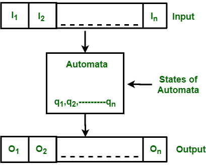

# Automata



The finite automata or finite state machine is an abstract machine which have five elements or tuple. It has a set of states and rules for moving from one state to another but it depends upon the applied input symbol. Basically it is an abstract model pf digital computer.

* simplest machine to recognize patterns

```
Q : Finite set of states.
Σ : set of Input Symbols.
q : Initial state.
F : set of Final States.
δ : Transition Function.

{ Q, Σ, q, F, δ }
```


### Deterministic Finite Automata (DFA) 

```
DFA consists of 5 tuples {Q, Σ, q, F, δ}. 
Q : set of all states.
Σ : set of input symbols. ( Symbols which machine takes as input )
q : Initial state. ( Starting state of a machine )
F : set of final state.
δ : Transition Function, defined as δ : Q X Σ --> Q.
```

In a DFA, for a particular input character, the machine goes to one state only. A transition function is defined on every state for every input symbol. Also in DFA null (or ε) move is not allowed, i.e., DFA cannot change state without any input character. 

For example, below DFA with Σ = {0, 1} accepts all strings ending with 0. 

One important thing to note is, there can be many possible DFAs for a pattern. A DFA with minimum number of states is generally preferred.

### Nondeterministic Finite Automata(NFA) 

NFA is similar to DFA except following additional features: 

1. Null (or ε) move is allowed i.e., it can move forward without reading symbols. 
2. Ability to transmit to any number of states for a particular input. 

However, these above features don’t add any power to NFA. If we compare both in terms of power, both are equivalent. 

Due to above additional features, NFA has a different transition function, rest is same as DFA. 

```
δ: Transition Function
δ:  Q X (Σ U ε ) --> 2 ^ Q. 
```

As you can see in transition function is for any input including null (or ε), NFA can go to any state number of states. 
For example, below is a NFA for above problem 

One important thing to note is, in NFA, if any path for an input string leads to a final state, then the input string accepted. For example, in above NFA, there are multiple paths for input string “00”. Since, one of the paths leads to a final state, “00” is accepted by above NFA. 


Some Important Points: 
 

    Justification: 
     

Since all the tuples in DFA and NFA are the same except for one of the tuples, which is Transition Function (δ) 

In case of DFA
δ : Q X Σ --> Q
In case of NFA
δ : Q X Σ --> 2Q

Now if you observe you’ll find out Q X Σ –> Q is part of Q X Σ –> 2Q.

In the RHS side, Q is the subset of 2Q which indicates Q is contained in 2Q or Q is a part of 2Q, however, the reverse isn’t true. So mathematically, we can conclude that every DFA is NFA but not vice-versa. Yet there is a way to convert an NFA to DFA, so there exists an equivalent DFA for every NFA. 


1. Both NFA and DFA have same power and each NFA can be translated into a DFA. 
2. There can be multiple final states in both DFA and NFA. 
3. NFA is more of a theoretical concept. 
4. DFA is used in Lexical Analysis in Compiler. 

TODO http://quiz.geeksforgeeks.org/regular-languages-and-finite-automata/

