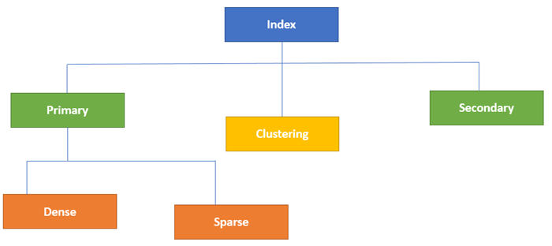

# Index

An Index is a key built from one or more columns in the database that speeds up fetching rows from the table or view. 

### Clustered

sorts the data rows in the table on their key values.

### Non-clustered 

stores the data at one location and indices at another location. 

| Parameters | Clustered | Non-clustered |
| --- | --- | --- |
| Use for | You can sort the records and store clustered index physically in memory as per the order. | A non-clustered index helps you to creates a logical order for data rows and uses pointers for physical data files. |
| Storing method | Allows you to stores data pages in the leaf nodes of the index. | This indexing method never stores data pages in the leaf nodes of the index. |
| Size | The size of the clustered index is quite large. | The size of the non-clustered index is small compared to the clustered index. |
| Data accessing | Faster | Slower compared to the clustered index |
| Additional disk space | Not Required | Required to store the index separately |
| Type of key | By Default Primary Keys Of The Table is a Clustered Index. | It can be used with unique constraint on the table which acts as a composite key. |
| Main feature | A clustered index can improve the performance of data retrieval. | It should be created on columns which are used in joins. |

### Primary

* Dense Index
* Sparse Index

### Secondary

### Multilevel

### B-Tree Index

