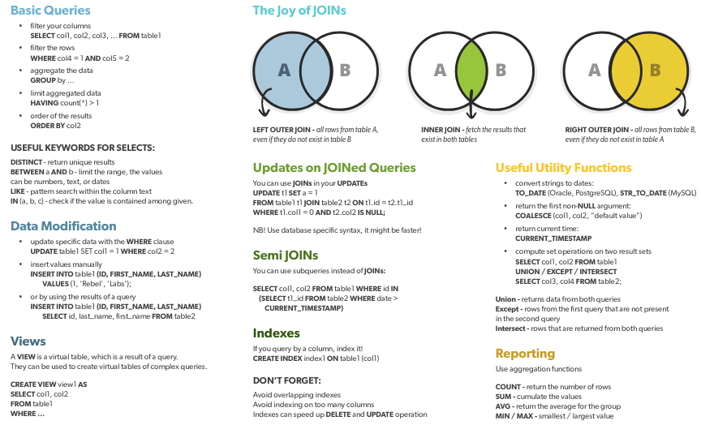

# Language

### DDL

data defination

* CREATE
* DROP
* ALTER
* COMMENT
* RENAME

### DQL

data query

* SELECT

### DML

data manipulation

* INSERT
* UPDATE
* DELETE
* LOCK
* CALL
* EXPLAIN PLAN

### DCL

data control (user-permissions)

* GRANT
* REVOKE

### TCL

transaction control

* COMMIT
* ROLLBACK
* SAVEPOINT
* SET TRANSACTION

### SQL

[interviewbit](https://www.interviewbit.com/sql-cheat-sheet/)

### Misc

* truncate deletes entire table
* 