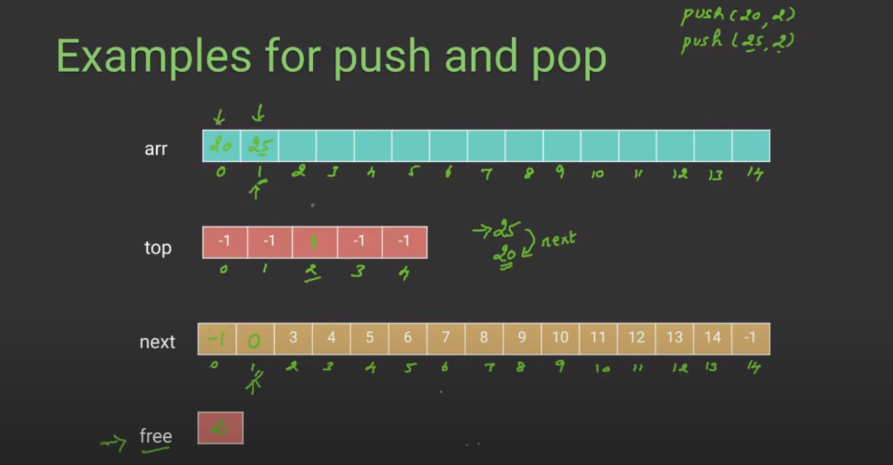

# K Stacks



# simple 

divide array into n/k

stack overflow even if space is available

# extra 2 integer arrays

1) top[k] -> top elements of stacks
2) next[] -> 

```
class kStacks 
{ 
	int *arr;
	int *top;
	int *next;
	int n, k; 
	int free;

public: 
	kStacks(int k, int n); 

	bool isFull() { return (free == -1); } 

	void push(int item, int sn); 

	int pop(int sn); 

	bool isEmpty(int sn) { return (top[sn] == -1); } 
};

kStacks::kStacks(int k1, int n1) 
{  
	k = k1, n = n1; 
	arr = new int[n]; 
	top = new int[k]; 
	next = new int[n]; 

	for (int i = 0; i < k; i++) 
		top[i] = -1; 

	free = 0; 
	for (int i=0; i<n-1; i++) 
		next[i] = i+1; 
	next[n-1] = -1;  
} 

void kStacks::push(int item, int sn) 
{ 
	if (isFull()) 
	{ 
		cout << "\nStack Overflow\n"; 
		return; 
	} 

	int i = free;

	free = next[i]; 

	next[i] = top[sn]; 
	top[sn] = i; 

	arr[i] = item; 
} 

int kStacks::pop(int sn) 
{ 
	if (isEmpty(sn)) 
	{ 
		cout << "\nStack Underflow\n"; 
		return INT_MAX; 
	} 

	int i = top[sn]; 

	top[sn] = next[i];

	next[i] = free; 
	free = i; 

	return arr[i]; 
}
```