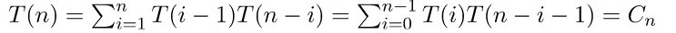

# Binary Tree Enumeration



### unlabeled trees
```

    o                 o
  /   \             /   \ 
 o     o           o     o 
```

n’th Catalan Numbers

```
For example, let T(n) be count for n nodes.
T(0) = 1  [There is only 1 empty tree]
T(1) = 1
T(2) = 2

T(3) =  T(0)*T(2) + T(1)*T(1) + T(2)*T(0) = 1*2 + 1*1 + 2*1 = 5

T(4) =  T(0)*T(3) + T(1)*T(2) + T(2)*T(1) + T(3)*T(0)
     =  1*5 + 1*2 + 2*1 + 5*1 
     =  14 

T(n) = sum(T(i-1) * T(n-i)) = sum(T(n-i-1) * T(i)) = Cn

T(i-1) represents number of nodes on the left-sub-tree
T(n−i-1) represents number of nodes on the right-sub-tree

T(n) = (2n)! / (n+1)!n!
```


### labeled trees

```
    A                C
  /   \             /  \ 
 B     C           A    B 
```

T(n) = (Number of unlabeled trees) * n! = [(2n)! / (n+1)!n!]  × n!