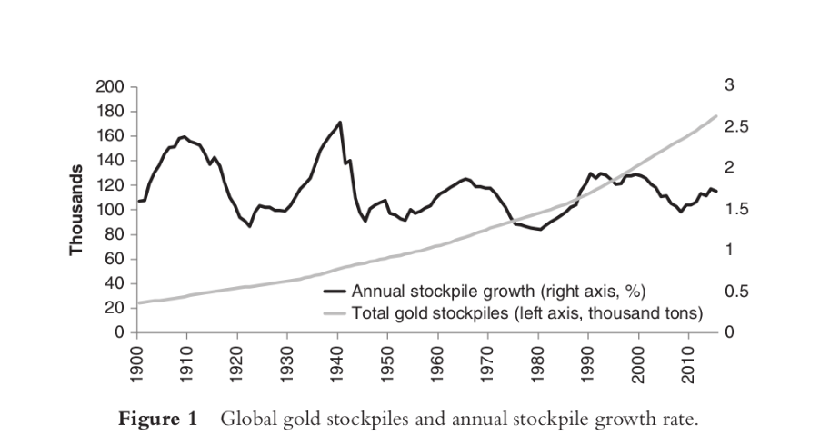

Lack of coincidence of wants across: 	Solution:
Goods: Not the same good. 	One
Time: I want to sell something today but I want to buy something in the future. 	Durable
Scale: I want to sell something large and only buy something small. 	

Homogenous, Divisible, and groupable

Space: I want to sell something in one location and buy something elsewhere.
	 Transportable

    Choices will quickly focus on the few most marketable commodities available.
    Demand for goods as medium of exchange on top of use demand increases their marketability. Also increases its price.
    As the more marketable commodities in any society begin to be picked by individuals as media of exchange, their choices will quickly focus on the few most marketable commodities available.
    Money existed long before governments. Governments did not make gold money. Governments had to use gold in their coins in order to get their coins accepted for trade.
    People are free to choose anything as a money, but over time, some things will function better.The things that function better have better marketability, reward their users by serving the function of money better.
    Cattle were a good choice at some point. Seashells, lime stones, glass beads, too.
    Metals were a good choice when they were hard to make. As they became harder to make, precious metals became money. Later, only the most precious of metals, gold. Why gold? Gold was money because it has the highest stock-to-flow ratio.
    Stock: all existing stockpiles that were produced in the past and are still available for the market. Ex: All gold produced up until year 2019

Flow: New annual production. Ex: annual production in 2019.
Stock to flow = (existing stockpiles) / (new annual production)

= 1 / (supply growth rate)

figure 1: Global gold stockpiles and annual stockpile growth rate.

    As monetary demand is added to industrial demand, the price rises. That stimulates more production. The metals with the highest stock-to-flow are the ones that will resist debasement through overproduction best.
    Chemistry: does not corrode, and cannot be synthesized. This means gold production has just been piling up for millennia, never getting consumed. So annual production for any particular year is tiny compared to existing stockpiles.
    Silver maintained its monetary role as long as it was needed for making in-person payments. As transactions moved to modern methods of payments like cheques and bills instead of the metals, everyone moved to the hardest money.
    Hardest money wins. Whatever is hardest to produce gets used as money.
    Modern industrialization has advanced to the point where we can make anything with the physical properties we desire. The only thing that matters today is the economic properties, in particular what governs the growth in supply.
    Bitcoin is an incredible invention because it perfects the economic properties of money, while forsaking all the physical qualities traditionally associated with money.

==

    Money is distinct from consumption goods and from capital goods.
    Consumption goods: acquired to be consumed for their own sake.
    Capital goods: acquired to produce consumption goods to be consumed in the future
    Money: acquired to be exchanged for a consumption or capital good in the future

==
Why is money an important invention?

    Increase the extent of the market, increasing the division of labor.

The establishment of a money on the market enormously increases the scope for specialization and division of labor, immensely widens the market for every product, and makes possible a society on a civilized productive level.

    Allow for complex economic calculation, increasing the time frame and technological sophistication of economic production.

Specialization today: Engineer in a factory that sells all over the world, only produces highly specialized input into a very complex production process. His skills are useless for anything else. Relies on the market for everything else. Long chains of production only allowed through specialization and through money.

    Increase the ability to save for the future, incentivizing capital accumulation and lowering time preference.

    Money is needed because of uncertainty. Money is a tool we use to tame the uncertainty of the future. The better a money is at holding its value, the less uncertain the future is.
    With money, human labor, capital accumulated, technological innovations, and trade take place in a large extended system of impersonal exchange. People who do not know each other and do not coordinate with one another directly, nonetheless manage to collaborate to produce highly sophisticated products over very complex production structures.

==

    Money is uniquely different from all economics goods in that it is the one good whose absolute quantity does not matter.
    Any supply of money is enough for any economy.
    Money is the good with the least diminishing marginal utility.
    Money is also different in that the more expensive it is to produce, the more desirable it is as money.
    Keynes, Friedman, and many economists objected to gold being used as money because of the high cost. But that cost is far lower than the real costs of a money that is cheap to produce.
