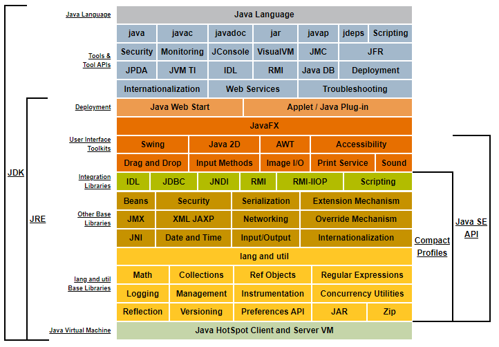

# What is Java?

[javase/tutorial](https://docs.oracle.com/javase/tutorial/)

Java is Object oriented by design.

| Procedural                           | Object-Oriented                        |
|--------------------------------------|----------------------------------------|
| Programs are divided into procedures | Into objects                           |
| Focus: procedure                     | Data                                   |
| Data moves throughout the program.   | Object communicates                    |
| none                                 | Data hiding, polymorphism, inheritance |

### programming language

* general-purpose
* high-level 

.java -> compiler -> .class (byte code) -> JVM (interpreter) -> machine code

perform additional steps at runtime to give your application a performance boost.
finding performance bottlenecks and recompiling (to native code) frequently used sections of code.

Simple
Object oriented
Distributed
Multithreaded
Dynamic
Architecture neutral
Portable
High performance
Robust
Secure

learn more at [whitepaper](https://www.oracle.com/java/technologies/language-environment.html)

### Platform

A platform is the hardware or software environment in which a program runs.
Java platform a software-only platform that runs on top of other hardware-based platforms.

* JVM
* Java API

* Development Tools - javac, java, javadoc etc
* API - basic objects, networking, security, XML generation, database access etc
* Deployment Technologies - Java Web Start and Java Plug-In for deploying your applications to end users.
* User Interface Toolkits -  JavaFX, Swing, and Java 2D (GUI)
* Integration Libraries - database access and manipulation of remote objects. (IDL, JDBC, JNDI, RMI, RMI-IIOP)

[docs](https://docs.oracle.com/javase/8/docs/index.html)

platform-independent environment

### Why?

* *Get started quickly*: powerful object-oriented language, it's easy to learn.
* *less code*: 4 times smaller than the same program written in C++. (based on methods, classes count etc)
* *better code*: good coding practices, automatic garbage collection, object orientation, JavaBeans™ component architecture, API
* *Develop more quickly*: 2x c++
* *portable*
* *Write once, run anywhere*
* *Distribute software easily*: With Java Web Start software.

### JEE vs JSE

Java™ Standard Edition (Java™ SE ) and the Java™ Enterprise Edition (Java™ EE). 