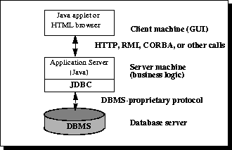

# JDBC

The JDBC API is a Java API that can access any kind of tabular data, especially data stored in a Relational Database.

* Connect to a data source, like a database
* Send queries and update statements to the database
* Retrieve and process the results received from the database in answer to your query

```
public void connectToAndQueryDatabase(String username, String password) {

    Connection con = DriverManager.getConnection(
                         "jdbc:myDriver:myDatabase",
                         username,
                         password);

    Statement stmt = con.createStatement();
    ResultSet rs = stmt.executeQuery("SELECT a, b, c FROM Table1");

    while (rs.next()) {
        int x = rs.getInt("a");
        String s = rs.getString("b");
        float f = rs.getFloat("c");
    }
}
```

### Components

* The JDBC API (java.sql and javax.sql)
* JDBC Driver Manager
* JDBC Test Suite
* JDBC-ODBC Bridge

### JDBC Architecture

**2 Tier**


In the two-tier model, a Java applet or application talks directly to the data source. This requires a JDBC driver that can communicate with the particular data source being accessed. A user's commands are delivered to the database or other data source, and the results of those statements are sent back to the user. The data source may be located on another machine to which the user is connected via a network. This is referred to as a client/server configuration, with the user's machine as the client, and the machine housing the data source as the server. The network can be an intranet, which, for example, connects employees within a corporation, or it can be the Internet.

**3 Tier**




In the three-tier model, commands are sent to a "middle tier" of services, which then sends the commands to the data source. The data source processes the commands and sends the results back to the middle tier, which then sends them to the user. MIS directors find the three-tier model very attractive because the middle tier makes it possible to maintain control over access and the kinds of updates that can be made to corporate data. Another advantage is that it simplifies the deployment of applications. Finally, in many cases, the three-tier architecture can provide performance advantages.

Until recently, the middle tier has often been written in languages such as C or C++, which offer fast performance. However, with the introduction of optimizing compilers that translate Java bytecode into efficient machine-specific code and technologies such as Enterprise JavaBeans™, the Java platform is fast becoming the standard platform for middle-tier development. This is a big plus, making it possible to take advantage of Java's robustness, multithreading, and security features.

With enterprises increasingly using the Java programming language for writing server code, the JDBC API is being used more and more in the middle tier of a three-tier architecture. Some of the features that make JDBC a server technology are its support for connection pooling, distributed transactions, and disconnected rowsets. The JDBC API is also what allows access to a data source from a Java middle tier.

### Result Sets and Cursors

The rows that satisfy the conditions of a query are called the result set. The number of rows returned in a result set can be zero, one, or many. A user can access the data in a result set one row at a time, and a cursor provides the means to do that. A cursor can be thought of as a pointer into a file that contains the rows of the result set, and that pointer has the ability to keep track of which row is currently being accessed. A cursor allows a user to process each row of a result set from top to bottom and consequently may be used for iterative processing. Most DBMSs create a cursor automatically when a result set is generated.

Earlier JDBC API versions added new capabilities for a result set's cursor, allowing it to move both forward and backward and also allowing it to move to a specified row or to a row whose position is relative to another row.

### Transactions

When one user is accessing data in a database, another user may be accessing the same data at the same time. If, for instance, the first user is updating some columns in a table at the same time the second user is selecting columns from that same table, it is possible for the second user to get partly old data and partly updated data. For this reason, DBMSs use transactions to maintain data in a consistent state (data consistency) while allowing more than one user to access a database at the same time (data concurrency).

A transaction is a set of one or more SQL statements that make up a logical unit of work. A transaction ends with either a commit or a rollback, depending on whether there are any problems with data consistency or data concurrency. The commit statement makes permanent the changes resulting from the SQL statements in the transaction, and the rollback statement undoes all changes resulting from the SQL statements in the transaction.

A lock is a mechanism that prohibits two transactions from manipulating the same data at the same time. For example, a table lock prevents a table from being dropped if there is an uncommitted transaction on that table. In some DBMSs, a table lock also locks all of the rows in a table. A row lock prevents two transactions from modifying the same row, or it prevents one transaction from selecting a row while another transaction is still modifying it.

### Stored Procedures

A stored procedure is a group of SQL statements that can be called by name. In other words, it is executable code, a mini-program, that performs a particular task that can be invoked the same way one can call a function or method. Traditionally, stored procedures have been written in a DBMS-specific programming language. The latest generation of database products allows stored procedures to be written using the Java programming language and the JDBC API. Stored procedures written in the Java programming language are bytecode portable between DBMSs. Once a stored procedure is written, it can be used and reused because a DBMS that supports stored procedures will, as its name implies, store it in the database. See Using Stored Procedures for information about writing stored procedures.

### Metadata

Databases store user data, and they also store information about the database itself. Most DBMSs have a set of system tables, which list tables in the database, column names in each table, primary keys, foreign keys, stored procedures, and so forth. Each DBMS has its own functions for getting information about table layouts and database features. JDBC provides the interface DatabaseMetaData, which a driver writer must implement so that its methods return information about the driver and/or DBMS for which the driver is written. For example, a large number of methods return whether or not the driver supports a particular functionality. This interface gives users and tools a standardized way to get metadata. In general, developers writing tools and drivers are the ones most likely to be concerned with metadata.

TODO

[LINK](https://docs.oracle.com/javase/tutorial/jdbc/index.html)