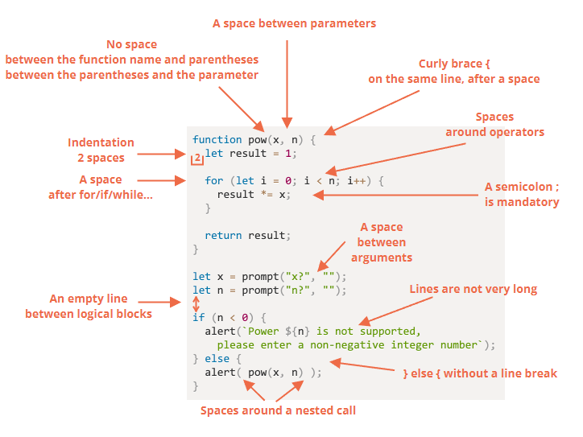

# js

* Modern JavaScript is a “safe” programming language. It does not provide low-level access to memory or CPU, because it was initially created for browsers which do not require it.
* **Same Origin Policy**: Different tabs/windows generally do not know about each other.
* Full integration with HTML/CSS.
* Simple things are done simply.
* Supported by all major browsers and enabled by default.

### Engines

* V8 – Chrome, Opera and Edge.
* SpiderMonkey – Firefox.
* Chakra - IE

1. The engine (embedded if it’s a browser) reads (“parses”) the script.
2. Then it converts (“compiles”) the script to the machine language.
3. And then the machine code runs, pretty fast.

### Ajax

### Comet

### Languages “over” JavaScript

which are transpiled (converted) to JavaScript

* **CoffeeScript** is a “syntactic sugar” for JavaScript. (Ruby Devs llike it)
* **TypeScript** - concentrated on adding “strict data typing”, by Microsoft.
* **Flow** also adds data typing, but in a different way. Developed by Facebook.
* **Dart** is a standalone language that has its own engine that runs in non-browser environments (like mobile apps), but also can be transpiled to JavaScript. Developed by Google.
* **Brython** is a Python transpiler to JavaScript that enables the writing of applications in pure Python without JavaScript.
* **Kotlin** is a modern, concise and safe programming language that can target the browser or Node.

### Variables

```
let $ = 1; // declared a variable with the name "$"
let _ = 2; // and now a variable with the name "_"

alert($ + _); // 3

let 1a; // cannot start with a digit

let my-name; // hyphens '-' aren't allowed in the name
```

### Mathematical operations are safe

Doing maths is “safe” in JavaScript. We can do anything: divide by zero (Infinity), treat non-numeric strings as numbers, etc.

The script will never stop with a fatal error (“die”). At worst, we’ll get NaN as the result.

### interaction

* alert: shows a message.
* prompt: shows a message asking the user to input text. It returns the text or, if Cancel button or Esc is clicked, null. 
* confirm: shows a message and waits for the user to press “OK” or “Cancel”. It returns true for OK and false for Cancel/Esc.

### null vs undefined

Treat any comparison with undefined/null except the strict equality === with exceptional care.
Don’t use comparisons >= > < <= with a variable which may be null/undefined, unless you’re really sure of what you’re doing. If a variable can have these values, check for them separately.

### Non-traditional ?

```
let company = prompt('Which company created JavaScript?', '');

(company == 'Netscape') ?
   alert('Right!') : alert('Wrong.');
```

### ??

```
The result of a ?? b is:

if a is defined, then a,
if a isn’t defined, then b.
```

|| returns the first truthy value.
?? returns the first defined value.

##### Using ?? with && or ||

```
let x = (1 && 2) ?? 3; // Works
```

### Labels

```
outer: for (let i = 0; i < 3; i++) {

  for (let j = 0; j < 3; j++) {

    let input = prompt(`Value at coords (${i},${j})`, '');

    // if an empty string or canceled, then break out of both loops
    if (!input) break outer; // (*)

    // do something with the value...
  }
}
alert('Done!');
```

Type matters in switch

### Function Declaration

```
// Function Declaration
function sum(a, b) {
  return a + b;
}
```

```
// Function Expression
let sum = function(a, b) {
  return a + b;
};
```

* A Function Expression is created when the execution reaches it and is usable only from that moment.
* A Function Declaration can be called earlier than it is defined.
* In strict mode, when a Function Declaration is within a code block, it’s visible everywhere inside that block. But not outside of it.

##### Arrow functions

```
let func = (arg1, arg2, ..., argN) => expressionlet func = (arg1, arg2, ..., argN) => expression
(...args) => { body }
```

### Clean Code



[Google's js style guide](https://google.github.io/styleguide/jsguide.html)

[ESLint](https://eslint.org/)

Comment this:

Overall architecture, high-level view.
Function usage.
Important solutions, especially when not immediately obvious.

Avoid comments:

That tell “how code works” and “what it does”.
Put them in only if it’s impossible to make the code so simple and self-descriptive that it doesn’t require them.