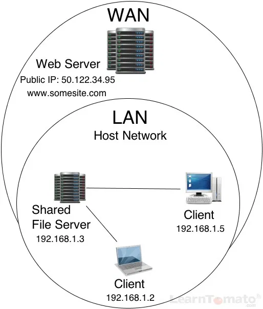

# Computer Networks

(Bible)[https://www.practicalnetworking.net/series/packet-traveling/packet-traveling/]

### Evolution

* Software-defined (SDN)
* Intent-based
* Virtualized
* Controller-based
* Multidomain integrations

### Types

* LAN
* WAN
* Enterprise
* Service-provider

### Terms

* client
* server
* host
* peer - "client server" (HTTP, FTP, NTFS) or "hierarchical" (NTP, NNTP, DNS)
* bandwidth
* jitter - time delay of packets'
* packet
* datagram- a segment of data sent over a packet-switched network
* frame - unit of data
* localhost
* bit rate
* latency
* speed
* attenuation - loss of signal strength (dB)
* amplification
* distortion - interruption of transmitting signals that cause an unclear reception
* unicast - 1:1
* braodcast - 1:all
  * limited -  in the local network
  * direct - bw networks
* multicast - IGMP (Internet Group Management Protocol), Multicast routing

### Noise

* thermal
* intermodulation (IM)
* crosstalk

### Web Vs Internet

the Internet is infrastructure while the Web is served on top of that infrastructure. 