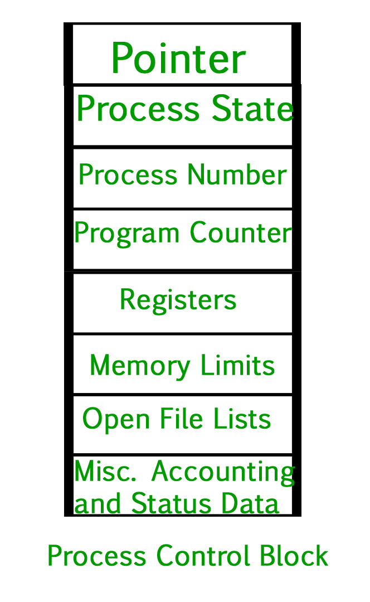

# Process

running program in mem.

### Structure

Stack
Heap
Data
Text

### States


* new
* ready
* running
* waiting (for I/O)
* terminated

### Types

### PCB



### Threads

segment of program, shared memory.

### Scheduling

order of processes.

* Long term -> jobs
* short term -> cpu allocation
* medium term -> process swapping

### Max Zombies?

```
#include<stdio.h>
#include<unistd.h>
  
int main()
{
    int count = 0;
    while (fork() > 0)
    {
        count++;
        printf("%d\t", count);
    }
}
```